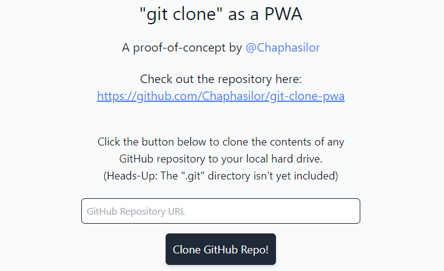

# "git clone" as a PWA

This is a quick and dirty proof-of-concept to show how you can use the new [File System Access API](https://web.dev/file-system-access/) to implement a `git clone`-like feature for a modern Web App.

## View the demo at https://chaphasilor.github.io/git-clone-pwa/

### Known limitations

- Only works in an up-to-date **desktop** browser (Edge, Chrome, Firefox?)  
  Sorry folks, no `git clone` for mobile users :P
- The `.git` directory won't be created by this tool  
  This could be added in the future, if there is demand...
